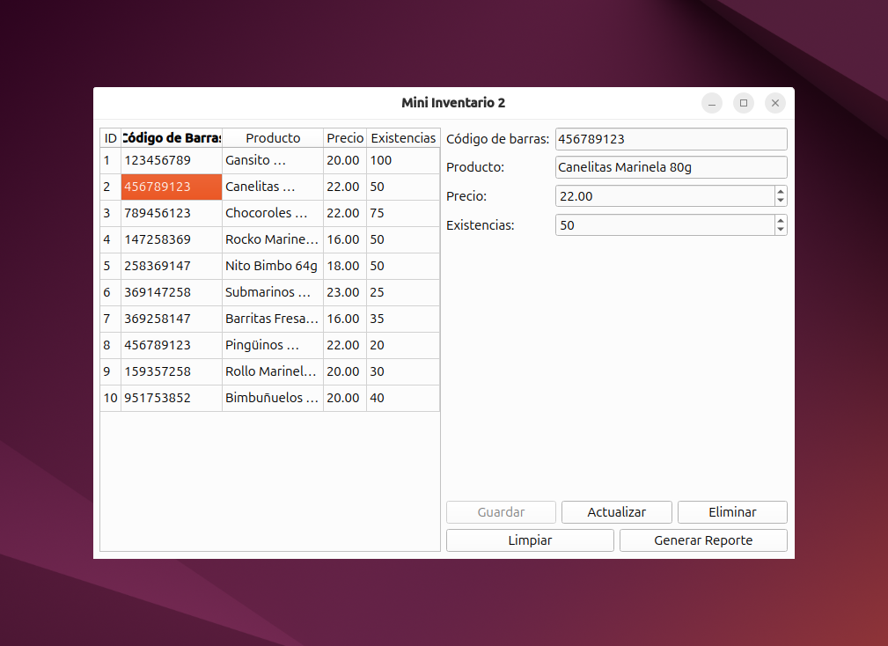
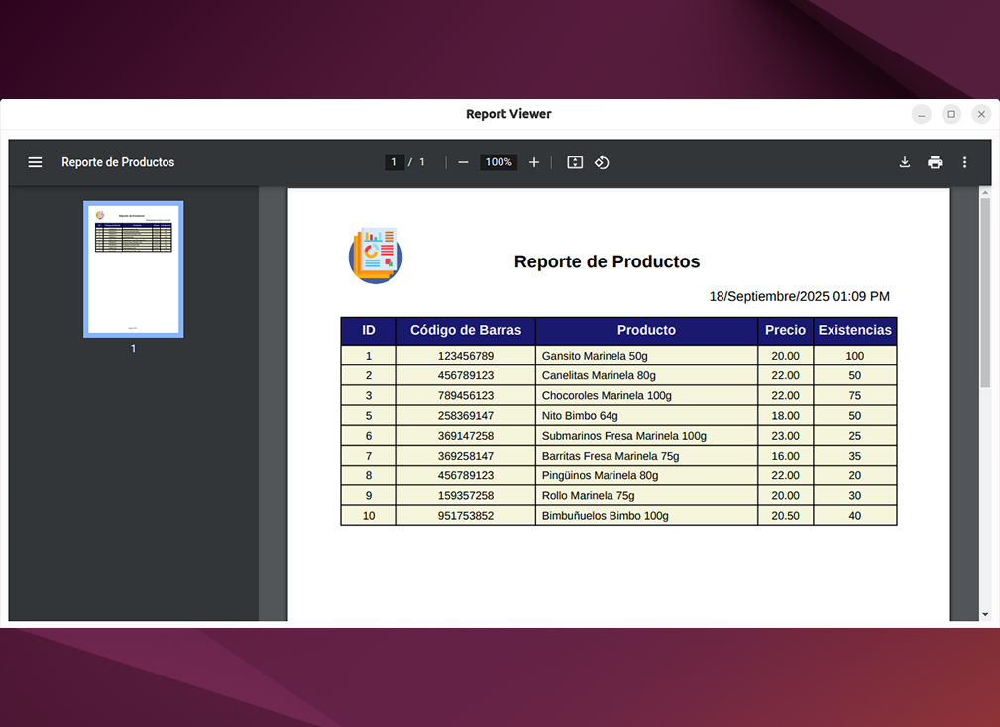

# Mini Inventario 2
Sistema para control de productos alimenticios desarrollado en Java con CRUD completo y generación de reportes en PDF.
Disponible como ejecutable para **Windows** y como paquete `.deb` para distribuciones **Linux** basadas en **Debian** (probado en Ubuntu).

## Tabla de contenido
- [Características principales](#características-principales)
- [Screenshots](#screenshots)
- [Tecnologías utilizadas](#tecnologías-utilizadas)
- [Requerimientos](#requerimientos)
- [Instalación](#instalación)
- [Desarrollo](#desarrollo)
- [Licencia](#licencia)

## Características principales
- CRUD de productos (Crear, Leer, Actualizar, Eliminar).
- Conexión a MariaDB para almacenamiento de datos.
- Interfaz gráfica desarrollada con **PySide6** (Qt).
- Visualización de registros en tabla dinámica.
- Generación de reportes **PDF** con logotipo, fecha actual y listado de productos (ReportLab).

## Screenshots

### Pantalla principal

> Pantalla principal con datos de prueba

### Pantalla de reportes

> Pantalla de previsualización de reportes

📂 Puedes ver más capturas en la carpeta [/screenshots](screenshots/).

## Tecnologías utilizadas
**Frontend**
- PySide6
- ReportLab

**Backend**
- Python 3.13.7

**Base de datos**
- MariaDB 12.0.2

#### Requerimientos
- [Python 3.13.7](https://download.oracle.com/java/23/archive/jdk-23.0.1_windows-x64_bin.exe)
- [pip](https://pypi.org/project/pip/)
- [MariaDB 12.0.2](https://mariadb.org/download/)

## Instalación

### Windows
- Copia y ejecuta el [esquema](database/scheme.sql) que se encuentra en el repositorio.
- Crea al usuario para el programa ejecutando la instrucción [seed](database/seed.sql).

Instala PySide6 y las librerías necesarias.
```bash
pip install pyside6 mariadb reportlab PyPDF2 pyinstaller
```

#### 2. Descargar el proyecto
Puedes descargar la versión más reciente de Mini Inventario 2 desde [GitHub Releases](https://github.com/mendozarojasdev/mini-inventario-python/releases/latest).
- Puedes colocar el ejecutable `.exe` en una ubicación p. ej. `C:\Program Files\Mini Inventario 2` y crear un acceso directo en el escritorio.


### 1. Crear base de datos
- Abre la consola de MariaDB
- Ingresa con usuario: **root** (sin contraseña por defecto).
- Copia y ejecuta el [esquema](database/scheme.sql) que se encuentra en el repositorio.
- Crea al usuario para el programa ejecutando la instrucción [seed](database/seed.sql).

### 2. Descargar el proyecto
Puedes descargar la versión más reciente de Mini Inventario 2 desde [GitHub Releases](https://github.com/mendozarojasdev/mini-inventario-java/releases/latest).

### 3. Instalar ejecutable
- Ejecutar el `.exe` para comenzar la instalación
- El programa se instalará por defecto en la ruta `C:\Users\(Usuario)\AppData\Local\Inventario\`, también es posible realizar la instalación en una ruta diferente p. ej. `C:\Program Files\Mini Inventario 2`, pero en este caso el ejecutable se debe ejecutar con privilegios de administrador.

## Desarrollo
Si deseas continuar con el desarrollo del proyecto.

✅ Listo, ahora podrás continuar con el desarrollo del proyecto.

## Licencia
Mini Inventario 2 está publicado bajo la licencia MIT. Consulta el archivo [MIT license](https://github.com/mendozarojasdev/mini-inventario-python/blob/master/LICENSE) para más información.
